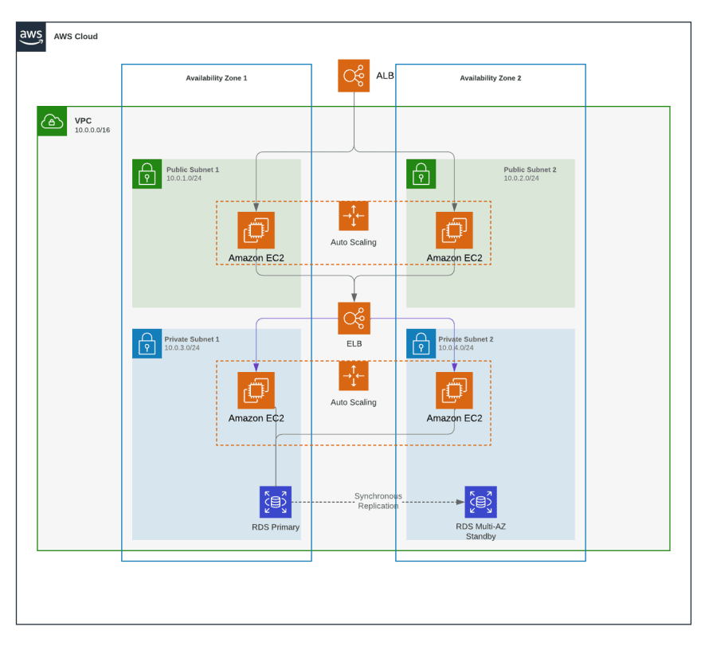

# terraform-public-site
We will be building a highly available application on top of AWS cloud services with Terraform.

This's example project follow up to this article [https://dev.to/eelayoubi/building-a-ha-aws-architecture-using-terraform-part-1-876]

## Project Architecture


## Terraform Resources
Under the terraform folder in the GitHub repository, you will notice couple of files:

- vpc.tf -> creates the vpc, public subnets, internet gateway, security group, route table
- lb.tf -> creates the application load balancer, the listener, and the target group
- ec2.tf -> creates the compute instances
- main.tf -> declares the providers to use (only the aws provider for now)
- variables.tf -> declares the variables used in the different resources

## STEPS TO DEPLOY SYSTEM
### Build these application images and push them to separate ECrs repositories
There is a setup-ecrs.sh script that will build these application images and push them to separate ECrs repositories. You can inspect the script for more details.

To run the script, first run ```chmod +x setup-ecrs.sh```, this will assign executable permission on our script. Then make sure you have aws cli installed and configured, we also need docker to be running, and simply type: ```./setup-ecrs.sh```
